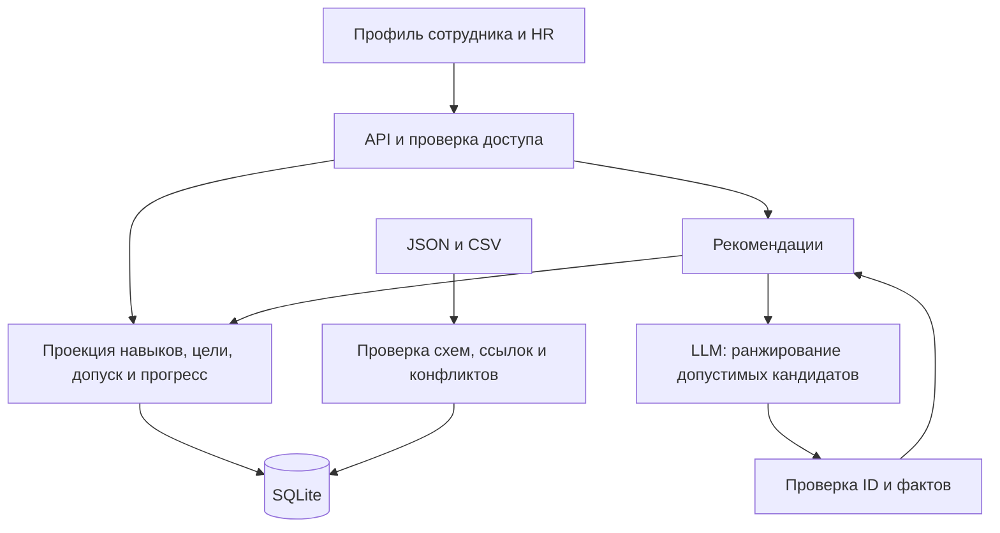

# Архитектура Career Quest

Проект сдаётся репозиторием для локального запуска у жюри. Выбран **модульный монолит Next.js на TypeScript с локальной SQLite и одним адаптером LLM**. Отдельный сервер базы данных и внешний хостинг не нужны.

Статус: архитектура и общие TypeScript-контракты подготовлены; UI-прототип уже находится в `frontend/`. Backend, Dockerfile и миграции ещё предстоит реализовать. Команда запуска ниже — целевой контракт поставки, не уже работающая команда этого репозитория.

## Документы для команды

- [Полная архитектура бэкенда](BACKEND.md): данные, правила, AI, API, транзакции, импорт, доступ, Docker и приёмка.
- [Общие TypeScript-контракты](../contracts/backend.ts): запросы, ответы, факты рекомендаций и интерфейс AI.

При детализации реализации решения по серверу берутся из BACKEND.md, формы данных — из contracts/backend.ts. Изменения контрактов согласуются с владельцами интерфейса и AI.

## Стек

| Часть | Решение |
|---|---|
| Интерфейс | Существующий Next.js App Router, React и CSS в frontend/ |
| API | Next.js Route Handlers, Node.js runtime |
| Хранилище | SQLite через Drizzle и better-sqlite3 |
| Runtime-валидация | Zod на основе согласованных типов |
| AI | Один серверный адаптер доступного команде LLM API |
| Проверки | Vitest, сквозной Playwright-сценарий, оценка AI против baseline |
| Поставка | Docker Compose, один app-контейнер, именованный volume для состояния |

## Схема



Профиль и HR работают без ожидания модели. Рекомендации загружаются отдельно. Код рассчитывает навыки, требования, допустимые действия и эффекты; LLM выбирает среди подготовленных кандидатов и указывает факты обоснования. Режимы ai, rules_fallback и no_candidates различаются в ответе.

Серверные модули добавляются в `frontend/src/server`, API — в `frontend/src/app/api`. Используется один Next-процесс и существующий lock-файл. Текущий UI-транспорт уже содержит согласованные маршруты; при подключении будут добавлены версии, сессии и обработка ошибок, а фикстуры останутся только в явно выбранном demo-режиме.

## Локальная поставка

Жюри клонирует репозиторий, готовит .env, размещает четыре официальных файла в data/source/ и запускает:

```sh
docker compose up --build
```

Приложение должно открываться на http://localhost:3000. Bootstrap применяет миграции и импортирует датасет только в пустое состояние. Весь каталог SQLite хранится в Docker volume; обычный перезапуск сохраняет прогресс. Исходные файлы подключаются read-only. Дополнительные профили загружаются через HR-интерфейс без пересборки.

Первая сборка требует сети для образа и зависимостей. Во время работы внешней LLM нужны интернет и ключ; без ключа приложение использует явно обозначенный baseline. Наш запущенный сервер и наш личный ключ не являются зависимостями поставки.

## Разделение работы

| Зона | Ответственность |
|---|---|
| Backend — наша | Хранилище, проекция навыков, цели, допуск, подготовительные шаги, HTTP, импорт, completion, права, bootstrap |
| UI | Профиль, траектория, рекомендации, действия, импорт и HR; версии, пустые состояния и fallback |
| AI | Адаптер, prompt, проверка ранжирования, оценка относительно многофакторных правил |

Один интегратор расширяет уже существующий UI-каркас контрактами, backend-зависимостями и командой проверки. Участники работают в своих зонах. Первый рубеж — полный сценарий на одном сотруднике; второй — весь датасет и новый профиль жюри; последний — запуск из чистого клона по README.
