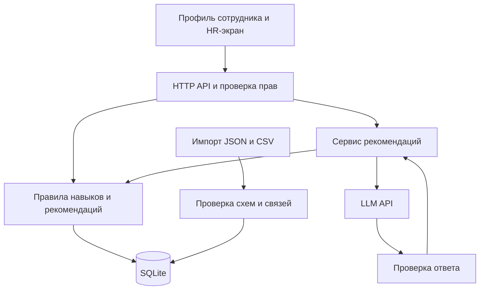

# Архитектура Career Quest

Предлагаемая архитектура для команды из трёх человек при исходном лимите пять часов: **одно приложение Next.js на TypeScript, SQLite и один серверный адаптер LLM**. Это проектное решение; код приложения пока не создан. На момент проверки в репозитории есть только README, установленного стека нет.

## Стек и запуск

| Часть | Решение | Причина |
|---|---|---|
| Интерфейс | Next.js App Router, React, TypeScript, Tailwind | Два основных экрана и общие типы с сервером |
| HTTP API | Next.js Route Handlers, Node.js runtime | Один проект, один адрес и один процесс приложения |
| Хранилище | SQLite через Drizzle и better-sqlite3 | Хватает для 200 сотрудников; отдельный сервер БД не нужен |
| Контракты | Zod-схемы и выведенные из них TypeScript-типы | Одинаковые форматы для API, интерфейса, импорта и AI |
| AI | Один адаптер доступного команде LLM API | Провайдер и модель задаются окружением; сначала проверяется реальный вызов |
| Проверки | Vitest для правил; один Playwright-сценарий | Проверяем расчёты и полный путь пользователя |
| Демо | Один Docker-контейнер приложения и постоянный каталог SQLite | Запуск через `docker compose up --build` после подготовки `.env` и датасета |

Зависимости фиксируются одним lock-файлом. Образ приложения и загрузка драйвера SQLite проверяются в первые 20 минут. База хранится на подключённом диске; выбранная схема предполагает один экземпляр сервера. JSON/CSV загружаются локально, исходный датасет и секреты не добавляются в публичный репозиторий.

Документация выбранных компонентов: [Next.js Route Handlers](https://nextjs.org/docs/app/getting-started/route-handlers), [Node.js runtime](https://nextjs.org/docs/app/api-reference/edge), [Drizzle с SQLite](https://orm.drizzle.team/docs/sqlite/get-started-sqlite), [валидация Zod](https://zod.dev/basics).

## Схема компонентов



Все блоки, кроме внешнего LLM API, находятся внутри одного приложения. Стрелки обозначают взаимодействия модулей, не отдельные сервисы.

## Главный принцип данных

У навыков есть **одно исходное состояние**: оценка из `employees.skills` на `last_review_date`. Текущие навыки вычисляются общей функцией из этой оценки и завершённых после неё участий.

При выполнении активности записывается факт завершения. Нельзя одновременно прибавлять навык к исходной оценке и затем снова учитывать то же завершение при восстановлении состояния.

Для каждого развиваемого навыка:

```text
effective_gain = max(0, min(gain, max_level - current_level, 5 - current_level))
new_level = current_level + effective_gain
```

Так курс не понижает навык, если он уже выше `max_level`. Повторная отправка одного завершения возвращает уже сохранённый результат, не начисляя прирост второй раз.

Профиль, рекомендации и HR используют один и тот же расчёт. Расчётная дата исходного набора — `2026-10-01` из метаданных. Новые действия демо получают явно заданное время сценария; завершение будущей сессии обозначается как симуляция и не выдаётся за фактическое посещение.

В импортированной истории нет отдельного `completed_at`: для самостоятельных курсов `date` означает зачисление. До уточнения у организаторов используем `date` как документированное допущение для завершённых исторических записей. Для новых завершений сохраняем отдельный `completed_at` и не повторяем эту неоднозначность.

## Хранилище

Минимальный набор таблиц:

- `dataset_meta`: дата среза, версия импортированных данных, версия состояния.
- `employees`: идентификатор, роль/грейд, цель, дата аттестации и исходные навыки.
- `skills` и `role_profiles`: справочник навыков, требования по ролям/грейдам и критические навыки.
- `events`: каталог, аудитория, условия допуска, расписание и правила прироста.
- `participations`: импортированная история и новые действия с устойчивым идентификатором участия.
- `sessions`: сессии заранее подготовленных демо-аккаунтов.

Вложенные структуры датасета можно хранить как JSON-поля. На этом объёме нет необходимости раскладывать каждый словарь навыков на отдельные таблицы. Целостность проверяется при импорте и при записи действий.

Исходная история сохраняется по `record_id`. Завершённое неповторяемое событие нельзя завершить повторно для того же сотрудника. Для `EV_036` отдельные участия различаются сессией/идентификатором; одна и та же сессия повторно не начисляется.

Импорт выполняется атомарно после проверки схем, идентификаторов и ссылок. Повторный импорт той же записи не дублирует участие. Совпавший ID с другим содержимым возвращает понятный конфликт вместо молчаливой перезаписи. Новый импорт повышает версию состояния.

## Поток рекомендации

1. **Восстановить состояние.** Посчитать текущие навыки и историю участия сотрудника.
2. **Определить цель.** Использовать `career_goal`. При отсутствии предложить следующий грейд текущей роли и указать `goal_source: suggested`. Для Lead без цели вернуть необходимость выбрать направление, не выдумывать грейд.
3. **Посчитать разрывы.** Взять требования целевой роли/грейда, отдельно отметить `critical_skills`.
4. **Определить допустимые активности.** Исключить обязательные; проверить аудиторию текущей роли/грейда, prerequisites, расписание, завершения и ненулевой полезный эффект. Начатую активность можно вернуть как `continue`, а не новое зачисление. Для переходов между профессиями строгий допуск по текущей роли — временная политика, пока организаторы не уточнят семантику.
5. **Сформировать факты для кандидатов.** Реальный прирост, уменьшение целевого разрыва, влияние на критические навыки, длительность, факты участия и отзывы. Если нет прямого уменьшения целевого разрыва, можно отдельно показать доказуемый подготовительный шаг, который открывает доступ к нужной активности.
6. **Вызвать LLM.** Передать один профиль и компактные данные всех подходящих кандидатов. Модель возвращает порядок 1–3 кандидатов, выбранные идентификаторы фактов и, при наличии, сравнение с альтернативой. На этом размере каталога не нужен векторный поиск.
7. **Проверить ответ.** Валидные ID, отсутствие дублей, допустимость активностей, действительные ссылки на факты и минимум три категории обоснования. Числа и факты на карточке рендерятся из серверных данных. JSON-валидация сама по себе не гарантирует истинность свободного текста; для MVP не позволяем произвольному тексту модели подменять проверенные факты.
8. **Вернуть результат.** AI-режим помечается `mode: ai`. При таймауте или невалидном ответе — многофакторное ранжирование с `mode: rules_fallback` и явным сообщением. Если кандидатов нет, возвращается пустой список и конкретная причина.

Вызов модели ограничивается примерно восемью секундами, чтобы оставить запас на вычисления и ответ в пределах десяти секунд из ТЗ. Общий срок измеряется; лимит сам по себе не доказывает соблюдение требования. В MVP нет автоматической цепочки повторных LLM-запросов.

Профиль и HR-экран не ожидают LLM. Сначала отображается детерминированное состояние, затем отдельно загружаются рекомендации. Для HR отсутствие доступного шага считается правилами, без 200 вызовов модели.

На старте обходимся без кэша рекомендаций. Ответ содержит `state_version`: интерфейс отбрасывает результат, если за время генерации произошло выполнение или импорт. После завершения активности пересчитываются профиль и рекомендации.

## Общие контракты

До параллельной работы согласовать Zod-схемы и JSON-примеры для четырёх ответов:

- `EmployeeView`: профиль, исходные и текущие навыки, цель и её источник, требования, разрывы, история, версия состояния.
- `RecommendationResult`: режим, версия состояния, список карточек, причины отсутствия кандидатов. Карточка содержит `event_id`, действие `start`/`continue`, проверенные факторы и ожидаемые изменения навыков.
- `CompletionResult`: идентификатор участия, признак повторного запроса, изменения навыков и новая версия состояния.
- `HrOverview`: частота целевых разрывов, сотрудники без шага с причинами, участие в активностях. Предложенные системой цели должны быть отделены от выбранных сотрудником.

Минимальные бизнес-маршруты:

| Метод и путь | Назначение |
|---|---|
| `GET /api/employees` | Список сотрудников для разрешённой роли |
| `GET /api/employees/:id` | Профиль и рассчитанная траектория |
| `POST /api/employees/:id/recommendations` | Рекомендации для актуальной версии состояния |
| `POST /api/employees/:id/completions` | Выполнение активности с ключом идемпотентности и идентификатором участия/сессии |
| `GET /api/hr/overview` | Минимальный HR-срез |
| `POST /api/import` | Загрузка дополнительных профилей и истории жюри |

Дополнительно нужны маршруты входа/выхода и проверки состояния сервера. Импорт готовых JSON/CSV достаточен: обработка ZIP внутри приложения необязательна.

## Доступ

Для демо — заранее созданные учётные записи и серверная cookie-сессия с ролями `employee` и `hr`. Сотрудник получает только свой профиль и действия. HR может открывать профили для демонстрации, видеть сводку и импортировать данные. Это проверяется в каждом обработчике; переданный браузером `employee_id` или переключатель экрана не задаёт права.

Ключ модели доступен только серверу. HR-данные и история других людей не возвращаются в сотруднических API-ответах. Свободные тексты импортированных описаний передаются модели как данные, а не как системные инструкции.

## Файловые зоны для трёх участников

```text
src/
  app/
    employee/              # Экран сотрудника
    hr/                    # Экран HR
    api/                   # HTTP-обработчики и проверка прав
  components/              # Компоненты интерфейса
  contracts/               # Zod-схемы и общие типы
  server/
    db/                    # Таблицы, импорт и запись действий
    domain/                # Навыки, цели, допуск, прогресс, сводки
    ai/                    # Вызов модели и проверка её ответа
    services/              # Сквозные операции
    auth/                  # Сессии и проверки доступа
tests/
  domain/
  recommendations/
  e2e/
docs/
  DEMO.md
```

| Зона | Кто берёт | Основная поставка |
|---|---|---|
| UI | Один участник | `app/employee`, `app/hr`, `components`; работает по согласованным контрактам и фикстурам |
| Данные и backend | Второй участник | `server/db`, `server/domain`, `server/auth`, API и сквозные сервисы |
| AI и проверка | Третий участник | `server/ai`, оценка рекомендаций, e2e, README и сценарий защиты |

Люди сами выбирают зоны. Один назначенный интегратор создаёт каркас, контракты, конфиги и lock-файл; затем остальные ответвляются. Backend вызывает заранее согласованную функцию AI, поэтому интеграция не требует параллельного редактирования одних обработчиков.

Первая интеграция — как можно раньше на одном сотруднике. К середине срока нужен полный сценарий на реальных данных. Последний час — проверки и репетиция, без расширения функций.

## Критические проверки

Проверить восстановление навыков после аттестации; отсутствие двойного начисления; сохранение навыка выше лимита курса; исключение обязательных и завершённых событий; prerequisites; смену роли; отсутствие цели и кандидатов; загрузку нового профиля; доступ employee/HR; неверный/медленный ответ модели; устаревший ответ после изменения состояния.

Проверка качества рекомендаций сравнивает AI с многофакторными правилами на одних профилях. Она не должна сравнивать только с заведомо слабым правилом минимального навыка. Результаты не заявляются до фактического измерения.

Одна команда проверки должна завершаться сама: проверка типов, доменные тесты, сборка и один сквозной браузерный сценарий. Отдельно — чистый запуск по README другим участником.
