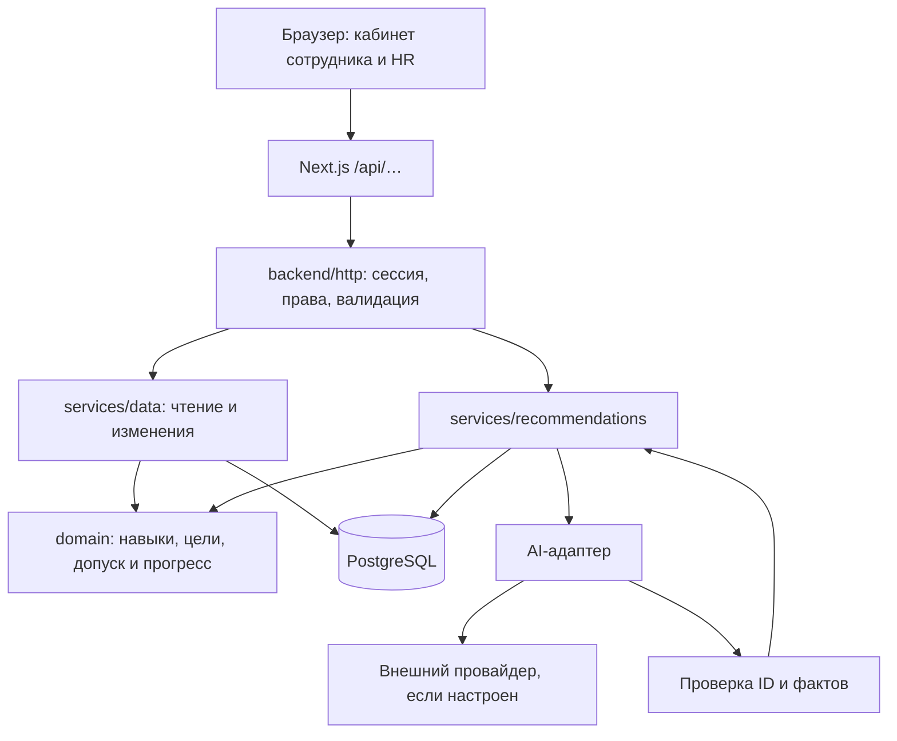

# Архитектура Career Quest

Career Quest поставляется репозиторием для локального запуска. Реализация — **модульный монолит на TypeScript: Next.js обслуживает UI и HTTP, отдельный workspace `backend/` содержит серверные модули, PostgreSQL хранит состояние**. Один сервер приложения обращается к одному серверу БД. Облачная база и инфраструктурный аккаунт не нужны.

В `backend/` реализованы хранение, миграции, bootstrap, доменные расчёты, HTTP, сессии, импорт, симуляции и адаптер AI. Это исполняемый код, а не только спецификация. Вызов реального AI-провайдера без настроенного ключа не проверен: в таком запуске сервер явно возвращает `rules_fallback`. Детали запуска и актуальные результаты общих проверок приведены в корневом [README](../README.md).

## Документы и исходники

- [Бэкенд подробно](BACKEND.md): данные, расчёты, API, транзакции и ограничения.
- [Общие TypeScript-контракты](../contracts/backend.ts): формат запросов, ответов и входа AI.
- [Серверный workspace](../backend/README.md): структура и команды разработки.

Типы в `contracts/` общие для команды; runtime-проверки находятся в серверном коде. Ни структура каталогов, ни название `backend/` не означают отдельный HTTP-процесс: Next импортирует этот workspace как локальный пакет.

## Стек

| Часть | Реализация |
|---|---|
| Интерфейс | Next.js 16, React 19, TypeScript, существующий CSS |
| HTTP | Next.js Route Handler в Node.js runtime → `backend/src/http` |
| Бизнес-правила | Чистые функции `backend/src/domain`, без зависимостей от UI и БД |
| Хранилище | PostgreSQL 18, схема Drizzle, SQL-запросы и транзакции через `pg` |
| Проверка входа | Zod; CSV через `csv-parse` с поддержкой BOM и кавычек |
| AI | Серверный адаптер Chat Completions со структурированным JSON и семантической проверкой |
| Тесты | Vitest: доменные, AI/HTTP и интеграционные PostgreSQL-проверки |
| Поставка | Docker Compose: `app` + `db`, именованный том PostgreSQL |

Зависимости двух workspaces устанавливаются из корня через `npm ci` и один корневой `package-lock.json`.

## Поток запроса



Профиль и HR рассчитываются без вызова модели. Для рекомендаций код сначала находит допустимые и полезные активности и вычисляет их эффекты. AI ранжирует подготовленных кандидатов и выбирает факты для объяснения. Он не создаёт активности, не начисляет навыки и не записывает данные в БД.

Исходный датасет остаётся неизменяемым. Выбор цели и симуляции хранятся отдельно. Профиль, рекомендации и HR используют одну проекцию этих данных, поэтому бизнес-формулы не дублируются во фронтенде.

## Модули

```text
contracts/backend.ts                 общий договор о данных
backend/src/domain/                  навыки, цели, история, кандидаты, HR
backend/src/services/data.ts          цели, выполнения, импорт, снимки, health
backend/src/services/recommendations.ts  версии, блокировка подбора, AI/fallback
backend/src/db/                      pool, Drizzle-схема, SQL-миграции, bootstrap
backend/src/validation/              схемы JSON/CSV и проверка связей
backend/src/auth/                    demo-аккаунты, хэши паролей, cookie-сессии
backend/src/ai/                      запрос провайдеру и проверка ранжирования
backend/src/http/                    маршрутизация, права, лимиты, ответы
backend/scripts/bootstrap.ts         запуск миграций и начальной загрузки
frontend/src/app/api/[...path]/route.ts  тонкий мост Next → backend
frontend/src/components/             пользовательский интерфейс
```

Чтение использует `REPEATABLE READ`, чтобы данные и revisions относились к одному снимку. Все изменения бизнес-состояния сейчас сериализуются блокировкой строки `app_meta`: это сознательное простое решение для текущего объёма, а не реализация параллельных записей по сотрудникам. Сетевой вызов AI не удерживает транзакцию БД.

## Локальная поставка

После подготовки `.env` и четырёх файлов в `data/source/`:

```sh
docker compose up --build
```

Compose запускает PostgreSQL и приложение. Перед HTTP-сервером bootstrap применяет миграции и один раз загружает датасет. Файлы источника подключаются только для чтения, в Git и образ они не включаются. Уже инициализированная БД сохраняет цели, импорт, симуляции и сессии; повторный bootstrap не заменяет их исходными файлами.

PostgreSQL хранится в именованном томе, смонтированном в `/var/lib/postgresql`. Обычный перезапуск и `docker compose down` сохраняют его. Удаление тома — отдельное явное действие пользователя, автоматического сброса нет.

Первая сборка требует сети для образов и пакетов. Для AI нужны ключ, модель и доступ к провайдеру. Без них доступен воспроизводимый подбор по правилам с пометкой `rules_fallback`; отсутствие подходящего шага возвращается отдельно как `no_candidates`.

## Границы текущего продукта

Приложение работает с одной компанией и двумя демонстрационными ролями. Регистрация пользователей, SSO, интеграции с кадровыми системами, фоновые очереди и распределённое ограничение запросов не реализованы. Вход ограничивается небольшим лимитером в памяти процесса.

Импорт добавляет новые ID и пропускает полностью одинаковые исходные записи; изменение существующего источника отклоняется. Выполнение активности — явно обозначенная симуляция, а не подтверждение реального посещения или основание для автоматического повышения.

Качество ранжирования живой модели, нагрузочные пределы и переносимость контейнера на все платформы не следуют из выбранного стека: их нужно подтверждать отдельными запусками. Подробные инварианты и уже выполненные проверки перечислены в [BACKEND.md](BACKEND.md).
