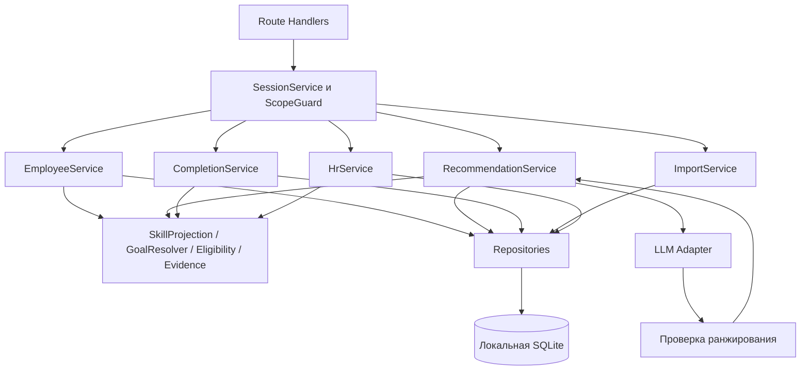

# Архитектура бэкенда Career Quest

**Решение: один сервер Next.js на TypeScript, встроенная SQLite, детерминированное доменное ядро и один адаптер LLM.** Жюри получает репозиторий и запускает приложение локально через Docker Compose. Отдельный сервер БД, хостинг и инфраструктурные аккаунты не требуются.

Статус: спецификация для реализации бэкенда. В репозитории уже появился UI-прототип в `frontend/`; он работает на явно обозначенных фикстурах. Реальный backend и контейнер ещё не реализованы/не проверены. Проверены ТЗ, официальный датасет и крайние случаи данных. Общие типы запросов, ответов и AI-интерфейса находятся в [contracts/backend.ts](../contracts/backend.ts). Этот документ — источник решений по бэкенду; [ARCHITECTURE.md](ARCHITECTURE.md) — обзор всего приложения.

## 1. Объём и критерии

Обязательный путь: выбрать сотрудника → увидеть профиль и цель → получить 1–3 обоснованных шага → смоделировать выполнение → увидеть новые навыки и траекторию → проверить HR-срез. Жюри должно загрузить дополнительные профили и историю без правки кода.

| Требование | Где обеспечивается |
|---|---|
| Произвольный профиль, история, карьерная траектория | EmployeeService и единый расчёт состояния |
| Многофакторный выбор и минимум три фактора обоснования | EligibilityEngine, EvidenceBuilder, AI validator |
| Корректный прирост навыков | SkillProjection и CompletionService |
| Проседающие навыки, отсутствие следующего шага, участие | HrService, без вызовов модели |
| Разделение employee/HR | SessionService и проверки в каждом HTTP-обработчике |
| Дополнительные файлы жюри | ImportService, валидация схем и связей, атомарная запись |
| UI до 2 секунд, AI до 10 секунд | Раздельные запросы, бюджет вызова модели, измерения |
| Одна команда запуска и воспроизводимость | Docker, bootstrap, миграции, README, сквозная проверка |

В первый объём не входят: обучение модели, векторная база, фоновые очереди, мультиагентный AI внутри продукта, магазин наград, прогноз увольнений, интеграции с кадровыми системами. Логика приложения остаётся модульной внутри одного процесса.

## 2. Проверенные свойства исходных данных

В предоставленном наборе 200 сотрудников, 40 активностей, 60 навыков, 32 профиля требований и 2 743 участия. Четыре активности обязательные; 12 имеют prerequisites. У 66 сотрудников нет цели, у 28 цель ведёт в другую роль; 10 сотрудников Lead не имеют цели.

Правила README: дата среза `2026-10-01`; отсутствующий навык равен нулю; навыки профиля отражают последнюю оценку; завершения после `last_review_date` ещё не учтены; `mandatory` не является объектом рекомендаций; прирост ограничен `gain` и `max_level`; повторяемое добровольное событие — `EV_036`.

Особенности, которые реализация должна сохранить:

- Повторные обязательные `EV_001`–`EV_003` реально присутствуют. Нельзя ставить общий запрет на повтор `employee_id + event_id` в истории.
- У `E0009` есть два `in_progress` одного `EV_035`: разные `record_id` — разные попытки, а не дубликаты.
- Уже начатая активность может относиться к предыдущему грейду: `E0181` имеет такую запись для `EV_022`.
- Для самостоятельных курсов `date` — дата зачисления, отдельной даты завершения нет. Это неоднозначность источника.
- При строгом допуске новых активностей по текущей роли/грейду у пяти сотрудников нет кандидата с положительным приростом. Это допустимое пустое состояние.
- Есть подготовительные цепочки: `EV_020` может открыть доступ к `EV_021`, хотя первый курс сам не сокращает целевой разрыв. Нельзя отфильтровать такие шаги до проверки prerequisites.

Источники: разделы 5–9 ТЗ Career Quest, `README.md`/`README.ru.md` и содержимое предоставленного датасета. Числа описывают этот набор, не являются ограничениями импортера. Диапазон идентификаторов `E0001`–`E0200` не зашивается в код.

## 3. Компоненты и зависимости



HTTP-обработчик выполняет разбор входа, проверку сессии/доступа, вызов сервиса и преобразование ошибки в HTTP. Доменные функции не импортируют Next.js, ORM или SDK модели; получают объекты и возвращают результат. Сервисы управляют транзакциями, репозитории — SQL. AI-модуль не имеет доступа к записи в БД.

```text
contracts/backend.ts                    общие типы команды, без runtime-зависимостей
frontend/src/contracts/                 реэкспорт корневого контракта
frontend/src/server/db/                  connection, schema, migrations, repositories
frontend/src/server/domain/              skills, goals, eligibility, evidence, progress, baseline
frontend/src/server/services/            employees, recommendations, completions, imports, hr
frontend/src/server/auth/                accounts, sessions, scope
frontend/src/server/ai/                  adapter, prompt, response-validator
frontend/src/app/api/                    тонкие HTTP-обработчики
frontend/scripts/                       bootstrap и команда проверки
frontend/tests/                         domain, integration, evaluation, e2e
```

Папка `frontend/` — уже существующий Next-проект, который становится полным приложением; название папки не требует второго сервера. Новые backend-модули отделены от components/styles. Используем существующие `frontend/package.json` и package-lock.json, не создаём второй Next-проект и второй набор зависимостей. Корневой contracts/backend.ts доступен через type-only re-export; контракт не дублируется вручную.

Пакеты: существующие Next.js/React/TypeScript; добавляются Drizzle с `better-sqlite3`, Zod для runtime-валидации, Vitest, Playwright. Стили существующего UI сохраняются, внедрять Tailwind не требуется. CSV разбирается готовым парсером с поддержкой кавычек и BOM; `split(',')` недопустим. Используем один реально доступный LLM-провайдер. Все зависимости фиксируются lock-файлом; адаптер не обязан поддерживать несколько провайдеров.

Текущий `frontend/src/lib/api.ts` уже содержит совпадающие адреса employee/recommendations/completions/hr/import. При интеграции он должен распаковывать ApiResponse, сохранять error.code/details, передавать версии и Idempotency-Key. Его клиентский timeout для AI следует сделать чуть больше серверного общего бюджета, например 12 секунд, чтобы получить ответ fallback при серверном лимите 10 секунд. Фикстуры и localStorage не подменяют ошибки API и перестают быть источником бизнес-состояния в connected-режиме. Выбор цели использует реальные role_profiles вместо прибавления единицы ко всем требованиям Lead.

## 4. Хранение и границы состояния

У данных три слоя: неизменяемые входные записи, изменения демо, вычисляемые представления. Исходный файл не перезаписывается при нажатии «выполнено». Текущие навыки не являются вторым независимым источником истины.

| Таблица | Основные поля и ограничения |
|---|---|
| `app_meta` | singleton, `as_of_date`, `dataset_revision`, `global_revision`, `seed_complete`, fingerprint исходного набора |
| `employees` | `employee_id` PK, нормализованный исходный профиль JSON, `source_hash`, `employee_revision`; роль/грейд/отдел можно вынести в индексируемые колонки |
| `skills` | `skill_id` PK, исходное описание |
| `role_profiles` | составной PK `(role,grade)`, requirements JSON, critical skills JSON |
| `events` | `event_id` PK, исходный каталог, `mandatory`, расписание и эффекты |
| `history_records` | `record_id` PK, FK employee/event, `date`, source status, исходная нормализованная запись и hash; строки неизменяемые |
| `goal_overrides` | `employee_id` PK/FK, выбранная цель или null, actor, real timestamp |
| `demo_completions` | ID PK, employee/event, nullable исходный `participation_id`, occurrence key, `applied_as_of`, `recorded_at`, actor, sequence |
| `action_receipts` | уникальный `(actor,operation,idempotency_key)`, hash запроса, business response, ссылка на результат |
| `import_batches` | ID, actor, fingerprint, счётчики добавленных/пропущенных записей, revisions, real timestamp |
| `accounts` | ID, unique username, password hash, role, nullable employee FK |
| `sessions` | hash случайного токена PK, account FK, время истечения по реальным часам |

Это логическая схема, миграции ещё предстоит написать. Вложенные словари допустимо хранить JSON-полями. Целостность JSON проверяется схемами до записи. FK включаются на каждом соединении. Индексы нужны для `history_records(employee_id,date)`, `history_records(event_id,status)`, `demo_completions(employee_id,sequence)` и session expiry; сложные индексы оптимизации не нужны до измерений.

У runtime-завершений уникален ненулевой `participation_id`: одна исходная попытка имеет не более одного overlay. Для неповторяемого добровольного события occurrence key — `once`; для `EV_036` — дата сессии. Уникальность `(employee_id,event_id,occurrence_key)` защищает runtime-начисления. Дополнительно CompletionService проверяет уже завершённую исходную историю в той же транзакции. Mandatory history не подпадает под эти ограничения.

Настройки: `foreign_keys=ON`, WAL, `synchronous=FULL`; runtime `busy_timeout` короткий, например 250 мс, с понятным `503 STORAGE_BUSY`, чтобы ожидание writer не съело двухсекундный бюджет. Для bootstrap допустим больший timeout. Точные задержки подтверждаются измерением.

## 5. Единый расчёт навыков

`projectEmployeeState` строит состояние в таком порядке:

1. Взять `employees.skills` как оценку на `last_review_date`. Недостающие навыки считать нулём, значения проверять в диапазоне 0–5.
2. Выбрать исходные `status=completed`, для которых `last_review_date < date <= as_of_date`, отсортировать по `(date,record_id)` и применить эффекты.
3. Применить runtime-завершения этого baseline по sequence. Они причинно произошли после импорта, поэтому применяются и тогда, когда дата аттестации совпадает с датой сценария.

Вторая стадия читает только исходный source status, никогда не effective_status представления. Иначе исходная in_progress с overlay completed начислится второй и третьей стадиями дважды.

Исторический `date` используется как proxy завершения при отсутствии `completed_at`; это допущение явно выводится в README. Равенство `date == last_review_date` повторно не начисляется. Частичное прохождение, отказ, пропуск, просрочка и score сами по себе прироста не дают: такого правила в README нет.

Для каждого эффекта активности:

```text
delta = max(0, min(gain, max_level - current_level, 5 - current_level))
after = current_level + delta
```

Исторические завершения применяются независимо от сегодняшнего грейда и допуска: они уже произошли. Ограничения посещения проверяются для нового действия, а не для переписывания прошлого. Числа никогда не выдаются на усмотрение LLM.

## 6. Цель и измерение прогресса

Приоритет источника цели: локальный выбор пользователя → импортированный `career_goal` → предложение следующего грейда текущей роли → отсутствие цели для Lead без выбранного направления. `goal_source` отражает `selected`, `imported`, `suggested` или `missing`. Сброс локальной цели в null убирает импортированную цель из активного выбора; далее можно показать предложение, явно не выдавая его за выбор сотрудника.

Явная цель может вести в другую роль и не обязана быть повышением в текущей. Целевая пара `(role,grade)` должна существовать в `role_profiles`. Грейд сотрудника не меняется автоматически после выполнения требований.

Для каждого требуемого навыка `gap = max(0, required-current)`. Отдельно показываются критические разрывы. Понятная шкала покрытия требований:

```text
coverage = sum(min(current[s], required[s])) / sum(required[s])
```

Учитываются только положительные требования целевого профиля. В API coverage — доля от 0 до 1, goal_coverage_delta — разница долей. Интерфейс умножает их на 100 для процентов и процентных пунктов. При отсутствии цели прогресс — null, не 0%. Все значения округляются только при отображении. 100% означает покрытие заданных навыков, не обещание повышения. При смене цели сравнение процентов до/после разных целей не интерпретируется как рост или падение сотрудника.

## 7. Допуск новых и начатых активностей

**Новый start:** событие добровольное; текущая роль и грейд входят в аудиторию; все prerequisites выполнены; самостоятельный курс доступен сейчас либо есть будущая сессия не раньше `as_of_date`; событие ещё не completed, кроме отдельной новой сессии `EV_036`. Если уже есть actionable in_progress, следует предложить продолжение, не дублирующее зачисление.

**Continue:** опирается на конкретный существующий in_progress. Его исходный допуск не пересматривается по новому грейду и новому расписанию; это уже начатое участие. Проверяются принадлежность, добровольность, отсутствие последующего завершения/overlay и ожидаемая польза. Если активных попыток неповторяемого события несколько, рекомендация выбирает максимальную `(date,record_id)`, не максимальный процент.

После завершения одной попытки другие исходные in_progress не удаляются и не переписываются. В представлении у них `actionable=false` и `superseded_by` с ID завершённого участия; повторный completion не начисляет навыки. Для выбранной завершённой попытки effective_status=completed и completion_pct=100. Для клуба отдельные даты остаются отдельными допустимыми участиями.

Политика MVP при смене профессии: целевые требования берутся из желаемой роли, но допуск новых событий — по текущей роли/грейду. Нельзя молча допустить сотрудника к чужой аудитории. Отдельно показываем блокировку каталога; организаторы могут уточнить это правило. `remote` не является автоматическим запретом offline: географии и запрета поездок в данных нет.

## 8. Полезность и подготовительные шаги

Доступность события и полезность для цели — разные проверки:

- `direct`: хотя бы один эффект уменьшает целевой gap.
- `prerequisite`: эффект открывает доступ к другому полезному событию.
- `general`: есть прирост, но доказуемой связи с текущей целью нет.

Для prerequisite достаточно ограниченного просмотра на один шаг вперёд: A доступно сейчас; B не доступно именно из-за prerequisites, проходит остальные ограничения; после полного эффекта A все prerequisites B выполняются; B уменьшает оставшийся целевой gap на состоянии после A. Если оба шага scheduled, нужна сессия B строго позже выбранной сессии A: порядок в одном дне неизвестен. Для self_paced B наличие upcoming_sessions не требуется. Для самостоятельного или уже начатого A дата завершения неизвестна — нельзя обещать уложиться в конкретную сессию B. Все цепочки условны до завершения A; общая длительность курса не интерпретируется как календарная длительность.

Это до 40×40 простых сравнений на профиль, без графовой базы и планировщика. Показываем `unlocks_event_ids`, будущую пользу B отдельно от непосредственного эффекта A. Подготовительный шаг может оставить `goal_coverage_delta=0`.

В основной список карьерных рекомендаций попадают direct и prerequisite. General можно показать отдельным каталогом, но нельзя объявлять продвижением к цели. Если целевые требования уже покрыты, вернуть `GOAL_REACHED`; при отсутствии цели — `GOAL_REQUIRED`; при отсутствии допустимых событий — `NO_ELIGIBLE_EVENTS`; при нулевом приросте всех доступных — `NO_BENEFICIAL_EVENTS`; после неудачного поиска direct/preparation — `NO_GOAL_RELEVANT_EVENTS`. Блокировки и причины сохраняются для HR.

Карточки 1–3 — ранжированные альтернативы следующего шага, не последовательный план. Эффект каждой считается от одной версии состояния; складывать эффекты карточек нельзя. После выполнения выбранного шага список пересчитывается.

## 9. Ранжирование и роль LLM

Сначала строится воспроизводимый baseline. Порядок сравнения кандидатов v1: число полностью закрытых критических разрывов; затем `weighted_direct_gain + 0.5 × weighted_unlocked_gain`; затем меньше негативных исходов в последних трёх завершённых/отклонённых/прерванных/пропущенных участиях того же события; затем меньшие трудозатраты; при полном равенстве предпочтение continue, затем tie-break по event ID и candidate ID. Вес критического навыка 2, остальных 1. Прямую пользу ограничиваем оставшимся разрывом до цели: рост вне цели и выше требования не повышает балл, хотя сохраняется в фактическом приросте. Для нескольких открываемых событий берём максимальную будущую пользу, не суммируем взаимоисключающие обещания. Это продуктовая эвристика для проверки, не обученная метрика и не доказанная вероятность успеха.

Реализованный вход AI-зоны — `recommend(input, { signals, signal, emptyReason })`; подготовка сигналов истории, обработка сбоев и команды проверки описаны в [AI.md](AI.md). Сервис по-прежнему отвечает за evidence, расчёт пользы открываемых событий и повторную проверку версии.

Негативная история не запрещает событие навсегда и не означает «низкую мотивацию». Отсутствие истории — отдельный факт, а не нулевая надёжность. История обязательного обучения не смешивается с добровольным выбором.

LLM получает компактный snapshot одного сотрудника: роль, грейд, цель, текущие разрывы, агрегированные релевантные факты истории и все допустимые целевые кандидаты. ФИО, руководитель и полная история всех сотрудников не требуются. Описания событий передаются как данные, не инструкции.

Модель возвращает только упорядоченные `candidate_id`, выбранные `reason_fact_ids` и при необходимости ID сравниваемой альтернативы. Сервер формирует текст объяснения из проверенных фактов и чисел. Валидатор проверяет JSON, диапазон 1–3, отсутствие дублей, принадлежность кандидатов snapshot, допустимость ссылок на факты и минимум три различные категории из grade / skill_gap / history / target_requirement. Факт отсутствия истории допустим, выдуманная история — нет.

Так AI влияет на выбор и акцент объяснения, но не создаёт события и приросты. Его добавочную пользу надо измерить относительно многофакторного baseline. Если AI не лучше, нельзя заявлять обратное; можно показать фактический результат сравнения и ограничения.

## 10. Задержки, версии и сбои AI

Профиль/HR читаются без AI. Рекомендации запрашиваются отдельно; вызов провайдера ограничен 8 секундами, общий ответ — целевыми 10 секундами. Для одного employee/version одновременно допускается один активный AI-запрос; повторный получает `429 RECOMMENDATION_IN_PROGRESS`, без скрытого повторного платного вызова. На первой версии не нужен кэш ответов.

| Счётчик | Когда растёт | Для чего |
|---|---|---|
| `dataset_revision` | Успешный импорт с новыми данными | Инвалидировать результаты, использующие прежний набор |
| `employee_revision` | Изменение цели или новое выполнение сотрудника | Контроль конкурентных действий над профилем |
| `global_revision` | Любой импорт с изменениями, goal или completion | Идентификация HR-снимка |

Пара `DomainVersion` и факты снимаются в одной короткой read-транзакции. Затем транзакция закрывается и вызывается LLM. После ответа пара проверяется ещё раз. Если изменилась — `409 STALE_RECOMMENDATION`, без автоматического повторного вызова и без выдачи fallback на устаревших данных. Интерфейс также отбрасывает несовпадающую пару; другой профиль может изменяться без инвалидирования этого ответа.

Без ключа, при timeout или невалидном AI-ответе возвращается baseline с `mode=rules_fallback` и конкретной причиной. `mode=ai` означает, что выбор получен от провайдера и принят валидатором. Пустой результат имеет `mode=no_candidates`, непустой empty_reason и fallback_reason=null; модель не вызывалась. Ключ остаётся серверной переменной, не `NEXT_PUBLIC_*`.

## 11. Завершение активности и транзакции

Для синтетического демо все новые выполнения явно имеют `simulation=true`. Фиксируем реальный `recorded_at`, расчётный `applied_as_of` и дату выбранной сессии. Будущую сессию можно смоделировать на текущем срезе; она помечается симуляцией, глобальные часы не сдвигаются. Профиль и HR сообщают, что состояние включает симуляции.

Запрос указывает либо существующий `participation_id`, либо новый event и session date. Session date для нового scheduled-события выбирается из upcoming_sessions; для self_paced — null. Продолжение использует дату исходного участия, не требует существования старой сессии в upcoming_sessions. Server вычисляет эффекты заново; клиент не передаёт уровни навыков или размер прироста.

Порядок обработки:

1. Проверить сессию, scope и схему запроса. `Idempotency-Key` обязателен для completion и фактического импорта.
2. Начать короткую write-транзакцию `BEGIN IMMEDIATE`.
3. Найти receipt для actor/operation/key. Hash включает method/operation, target_employee_id из URL и нормализованное тело, включая expected_version. При том же запросе вернуть прежний business result; при другом теле или target — `409 IDEMPOTENCY_CONFLICT`. Это делается **до** проверки версии: иначе повтор запроса конфликтует со своим первым выполнением.
4. Проверить expected versions, участие, повторяемость, допуск нового действия и конкретную сессию. Все проверки источника и overlay идут в этой транзакции.
5. Записать completion/overlay, повысить employee/global revisions, вычислить новый snapshot и сохранить receipt. Commit.
6. Вернуть изменения навыков и версию. При replay возвращается исходный business result с его версией и `meta.replayed=true`; интерфейс при необходимости отдельно обновляет профиль.

Второй запрос того же участия с другим ключом не начисляет прирост: `ALREADY_COMPLETED`/`SESSION_ALREADY_COMPLETED`. При двух разных активных попытках неповторяемого события первый успешный completion выигрывает. `USE_EXISTING_PARTICIPATION` запрещает обход начатого участия созданием нового start.

В транзакции нет `await`, сетевых запросов или LLM. При ошибке изменения и receipt откатываются вместе. Уникальные ограничения БД дополняют проверки сервиса, а не заменяют проверку исходной истории.

## 12. Импорт стартового набора и данных жюри

Bootstrap загружает все четыре файла. HTTP-импорт принимает `multipart/form-data`: optional employees JSON в исходной обёртке `{meta,employees}`, optional history CSV, expected_dataset_revision и dry_run. Нужен хотя бы один файл. Справочники через HTTP в MVP не заменяются; новые профили ссылаются на существующие role/skill/event ID.

Валидация до записи: UTF-8/BOM, уникальные заголовки CSV и идентификаторы; числа, enum и реальные даты; уровни 0–5; ссылки на роли, цели, навыки, события, сотрудников и руководителей; весь пакет рассматривается вместе с существующими данными. Meta.as_of_date файла сотрудников совпадает с текущим срезом; last_review_date и history.date не позже as_of_date. CSV без meta относится к текущему срезу. Пустые score/feedback/due_date — null, не ноль. Не проверять историю по сегодняшнему грейду: README разрешает предыдущий. Не запрещать несколько in_progress и ежегодные mandatory completed.

Новые исторические completed проверяются и против simulation ledger. Если у того же сотрудника уже смоделировано неповторяемое добровольное событие либо та же дата клуба, импорт возвращает IMPORT_CONFLICT. Иначе прошлое завершение и симуляция начислят один эффект дважды. Аналогичные конфликты внутри самого входного пакета также отклоняются; mandatory исключены из этого запрета.

Лимит входа — 20 MiB суммарно, до 1 000 профилей и 50 000 строк истории за запрос; это ограничения нашего MVP, не размера официального набора. Их превышение возвращает `413`, а не усечение данных. Неизвестные поля нельзя молча использовать как инструкции модели.

Политика merge: новый ID добавляется; идентичная исходная нормализованная запись пропускается; тот же ID с другим содержимым даёт `409 IMPORT_CONFLICT`. Сравнивается immutable source hash, а не цель или статус после действий в демо. Изменение существующего baseline через импорт не поддерживается. Если жюри потребует замену профиля с прежним ID, нужно отдельно согласовать семантику замены; переименование IDs без исправления связей не предлагается.

`dry_run` возвращает counts, warnings и ошибки с filename/row/field, но ничего не меняет. Commit повторно проверяет ссылки и ожидаемую версию, пишет пакет атомарно. Даже одна ошибка исключает частичный импорт. Успешный noop не повышает domain revisions. Запись receipt/batch позволяет безопасно повторить запрос. Ручной reset демо — отдельная операция, не часть импорта.

## 13. API и права

Все даты сценария — `YYYY-MM-DD`, реальные timestamps — UTC ISO 8601. Идентификаторы — строки без привязки к диапазону исходного набора. Успех: `{data,meta:{request_id,as_of_date,replayed?}}`; ошибка: `{error:{code,message,details?},request_id}`. Только до инициализации набора, например у health 503, meta.as_of_date может быть null. Схемы в `contracts/backend.ts` должны быть реализованы runtime-валидаторами Zod, TypeScript сам не проверяет входящий JSON. Список сотрудников принимает q/department/role/grade, offset>=0 и limit 1–200 (default 50), сортировка по employee_id; total — число после фильтров, до pagination.

| Метод и путь | Доступ | Смысл |
|---|---|---|
| `GET /api/health` | Без входа | Готовность БД/схемы/seed, без вызова LLM |
| `POST /api/auth/login` | Без входа | Вход заранее созданного demo-аккаунта |
| `GET /api/auth/session` | Session | Текущий actor и разрешения |
| `POST /api/auth/logout` | Session | Отозвать сессию |
| `GET /api/catalog` | Session | Навыки, роли/грейды, шкала и каталог без данных других сотрудников |
| `GET /api/employees` | HR | Список профилей для выбора, query/filter/pagination |
| `GET /api/employees/:id` | Self / HR | Профиль, история, цель, разрывы и версия |
| `PUT /api/employees/:id/goal` | Self / HR demo | Изменить цель с expected_version |
| `POST /api/employees/:id/recommendations` | Self / HR | Получить выбор для expected_version |
| `POST /api/employees/:id/completions` | Self / HR demo | Симуляция выполнения, expected_version и Idempotency-Key |
| `GET /api/hr/overview` | HR | Согласованный агрегированный снимок |
| `POST /api/import` | HR | Проверка или добавление профилей/истории |

HR-запись за другого сотрудника — специально документированная привилегия **синтетического локального демо**, чтобы жюри проверяло импортированные профили без создания 200 аккаунтов. Actor и target_employee_id сохраняются раздельно. Это не модель прав для кадровой системы в эксплуатации.

Типовые ошибки: `400 VALIDATION_ERROR`, `401 UNAUTHENTICATED`, `403 FORBIDDEN`, `404 NOT_FOUND`, `409 REVISION_CONFLICT`, `409 STALE_RECOMMENDATION`, `409 IMPORT_CONFLICT`, `409 IDEMPOTENCY_CONFLICT`, `409 ALREADY_COMPLETED`, `409 SESSION_ALREADY_COMPLETED`, `409 USE_EXISTING_PARTICIPATION`, `422 INELIGIBLE_EVENT`, `413 PAYLOAD_TOO_LARGE`, `429 RECOMMENDATION_IN_PROGRESS`, `503 STORAGE_BUSY`. Неверный expected version возвращает текущую версию только уже авторизованному actor. Ошибка провайдера при доступном fallback — успешный degraded recommendation response, не ошибка записи.

## 14. Сессии и безопасность локального приложения

Два заранее подготовленных аккаунта: employee связан с одним профилем, HR работает с любым. Пароли хэшируются стандартной библиотекой, не хранятся открыто в таблице. Сессионный token — криптографически случайный, в БД хранится hash; cookie HttpOnly, SameSite=Lax, host-only. Для localhost HTTP `Secure=false`; при HTTPS — true по конфигурации, а не просто по NODE_ENV. Session TTL, например 12 часов, считается по настоящему времени.

На изменяющих запросах и login проверяются Origin и ожидаемый Content-Type; допустимый origin явно задан конфигурацией localhost. Для CLI-проверок Origin передаётся явно. CORS для произвольных сайтов не включается. Каждая операция проверяет employee scope на сервере; скрытой кнопки недостаточно. Для персональных API `Cache-Control: private, no-store`.

В логах: request ID, операция, время, код результата, безопасные ID и режим AI. Не логировать cookie, ключи, пароли, весь импорт или весь prompt. Пользователь не может передать произвольный LLM URL в HTTP-запросе: endpoint провайдера задаётся серверной конфигурацией.

## 15. HR-срез без вызовов модели

В одной короткой read-транзакции читаются исходные данные, overlays и global_revision. После освобождения snapshot доменные расчёты строят ответ; исходные объекты snapshot не изменяются. Размер данного набора позволяет считать в памяти без материализованных агрегатов.

- По каждому навыку: число сотрудников с разрывом, число сотрудников, у чьей активной цели есть это требование, сумма gap. Знаменатель не равен автоматически всем 200. Предложенные цели отмечаются отдельно от выбранных/импортированных.
- Без следующего шага: employee ID, цель, причина отсутствия direct/preparatory кандидата. Отсутствие цели и полностью достигнутая цель не называются отсутствием мотивации.
- По каждой активности и суммарно: counts всех исходных статусов и отдельные эффективные counts сценария. Existing-participation simulation заменяет статус этой попытки в сценарном представлении; new participation добавляет одну запись. Перекрытые in_progress исключаются из effective_by_status и учитываются отдельно в superseded_attempts, но остаются в исходной истории и actual_by_status. Таким образом суммы не скрывают пропавшие попытки.
- Actual и scenario статистика различимы; нет публичного рейтинга результативности сотрудников и кадровых прогнозов.

## 16. Docker, bootstrap и поставка

Один Compose service `app`, Node 24 на Debian Bookworm; build/runtime одной версии, libc и архитектуры. `npm ci` выполняется внутри Linux image, native `better-sqlite3` не копируется с macOS. На build-стадии доступны инструменты компиляции addon при отсутствии подходящего prebuilt. Конкретные версии image/dependencies фиксируются после smoke test.

Первый вариант запускает обычный `next start` из `/app/frontend`. Docker build context — корень репозитория, чтобы в образ попали frontend и общие contracts. Установку зависимостей выполняем по frontend/package-lock.json. Нынешний UI start script слушает 127.0.0.1: внутри контейнера entrypoint обязан явно запустить Next с `--hostname 0.0.0.0`. Build не открывает БД и не требует датасета, ключа или вызова модели. Bootstrap исполняется отдельно до HTTP: config → DB и PRAGMA → закоммиченные миграции → seed при отсутствии `seed_complete` → exec сервера. Его исполняемый файл и зависимости включаются в image и проверяются запуском; next build сам не компилирует произвольные CLI-скрипты. Генерация миграций на машине жюри не требуется.

Seed выполняется одной транзакцией и устанавливает marker только после успешного импорта. Файл SQLite сам по себе не означает успешную инициализацию. Ошибка оставляет понятный лог и ненулевой exit code, а не пустой здоровый сервер. При следующем старте успешный seed не повторяется, изменения файлов source не затирают прогресс.

Размещение: `/app/state` — именованный volume с SQLite и WAL/SHM; `./data/source:/app/data/source:ro` — официальный набор. Пользователь процесса имеет право записи в state. Внутри приложение слушает `0.0.0.0:3000`, снаружи публикуется `127.0.0.1:${APP_PORT:-3000}:3000`. Пути разработчика в исходниках отсутствуют.

В Git: исходники, Dockerfile, compose.yaml, lock, миграции, `.env.example`, README, небольшие самостоятельно созданные fixtures. Официальный набор, локальная БД, `.env`, логи и node_modules исключаются как из Git, так и из Docker context. Fixture не подставляется молча при отсутствии официального набора.

README должен дать точный порядок: Docker с Compose → clone → `.env.example` в `.env` → четыре файла непосредственно в `data/source` → `docker compose up --build` → открыть localhost. Для PowerShell и shell дать соответствующие команды копирования. Отдельно описать аккаунты, импорт, AI-настройки, ошибку отсутствующего набора и сохранение состояния.

Конфигурация: APP_PORT, DATABASE_PATH, DATASET_DIR, DEMO_MODE, APP_ORIGIN, LLM_MODEL, LLM_API_KEY, LLM_TIMEOUT_MS; провайдер/endpoint только фактически реализованный адаптер. Источник сценарной даты — meta, не системная дата. Без ключа приложение запускается с пометкой rules_fallback. Первая сборка требует сеть для образа/зависимостей, внешняя LLM — сеть и ключ. Готовый deterministic сценарий не зависит от нашего компьютера.

`GET /api/health` проверяет БД, миграции и seed; 200 при готовности, иначе 503. `ai_configured` говорит только о наличии конфигурации, не проверяет провайдера. Проверка здоровья не расходует токены.

Обычный `docker compose down` сохраняет volume. Явный `docker compose down --volumes` удаляет прогресс, импорты и сессии текущего проекта; затем новый запуск восстанавливает исходный набор. Это только документируемая ручная команда, автоматического reset при старте нет.

## 17. Проверка и критерии завершения

| Проверка | Ожидаемый результат |
|---|---|
| Исходный официальный набор | Загружается целиком; повторные mandatory и несколько in_progress не отвергаются |
| `E0001` и `R002727` | App Security учитывается после аттестации; вся история не начисляется повторно |
| Imported completion в день аттестации | Повторный прирост отсутствует |
| Runtime completion в день baseline | Применяется один раз, потому что причинно после baseline |
| Current level выше max_level | Навык не уменьшается |
| `E0009`, две попытки EV_035 | Continue указывает конкретную последнюю попытку; после одного completion вторая не начисляет |
| `E0181`, ранее начатый EV_022 | Continue не исчезает только из-за сегодняшнего Senior |
| Подготовительный путь EV_020 → EV_021 | Отображается условное открытие доступа; прямой прогресс A не выдумывается |
| Lead без цели / смена профессии | Нет выдуманного грейда; цель и условия допуска отделены |
| Нет подходящего шага | Понятный reason и HR-запись, никаких вымышленных событий |
| Повтор HTTP с тем же ключом | Прежний business result, без второго прироста и изменения revisions |
| Тот же ключ с другим телом / другой ключ той же сессии | Конфликт, без изменения навыков |
| Один невалидный ряд импорта | Ноль записанных строк всего пакета |
| Повтор исходного CSV после симуляции | Сравнение с source, overlay не затирается |
| Импорт/выполнение во время LLM | Старый ответ отвергается по версии |
| Чужой employee ID / HR URL от employee | Доступ запрещён сервером |
| LLM timeout/невалидный ID | Явный rules_fallback в пределах бюджета |
| Restart контейнера | Прогресс и импортированные профили сохранены |
| Чистый clone и README | Другой участник запускает весь сценарий без скрытых файлов/наших сервисов |

AI-evaluation использует раздельные наборы настройки и проверки: несколько конфликтных синтетических профилей плюс реальные крайние случаи. Метрики: доля допустимых рекомендаций, фактическая верность объяснений, использование трёх факторов, экспертная оценка релевантности, задержка и fallback rate. Сравниваются минимальный навык, многофакторный baseline и AI. Скрытые профили жюри неизвестны; подмена тестов ответами из примера недопустима.

Одна команда проверки завершается сама: typecheck → unit/integration → build → один e2e с запуском и остановкой временного сервера. Тестовая БД и Compose project изолированы от живого демо. Опубликованные выводы о скорости, Docker-платформах и качестве AI основываются только на фактических результатах.

## 18. Реализация по зонам

Существующий UI-каркас сохраняется. Один интегратор добавляет contracts, backend-модули, миграции, Docker skeleton и команду проверки в этот Next-проект. UI и AI могут работать по типам и самостоятельно созданным примерам, пока backend реализуется.

| Владелец зоны | Файлы | Передача результата |
|---|---|---|
| Мы: backend | db, domain, services, auth, HTTP, bootstrap | API, pure functions, рассчитанные AI inputs, интеграционные проверки |
| Участник UI | страницы employee/HR, components | Вызовы согласованного API, версии, loading/empty/fallback states |
| Участник AI | ai adapter/prompt/validator, evaluation | `rankCandidates(input, signal)`, schema-valid IDs и измерения относительно baseline |

Последовательность backend: импорт/проекция → профиль/цель/допуск → completion и идемпотентность → HR/import/auth → подключение AI → чистый Docker-run. Auth guard закладывается в обработчики сразу, даже если demo login подключается позже. Первый сквозной путь собирается на одном профиле; затем проверяется весь набор. До готовности этого пути дополнительные возможности не добавляются.

Договорённость команды: `contracts/backend.ts` меняется согласованно; общие зависимости и конфиги имеет один владелец. Нельзя одновременно переписывать одну зону разными агентами в одном checkout. Перед слиянием — независимая проверка доменных инвариантов и контрактов.

## 19. Открытые вопросы и принятые временные решения

1. Реальная дата завершения self_paced отсутствует: proxy=date, прямо документирован.
2. Допуск событий целевой профессии не определён: для новых действий используем текущую роль, показываем блокировки.
3. Замена профиля жюри с уже существующим ID не описана: add/identical-only; конфликт не затирает состояние.
4. Правила передачи синтетического набора облачному LLM и публикации противоречиво сформулированы в ТЗ: ключ и провайдер задаются локально, в Git нет самого набора; детали использования API уточняются у организаторов.
5. Модель и ключ ещё не выбраны/не проверены: этот факт не мешает доменному ядру и не считается работающим AI.

Это проектные ограничения, не причины останавливать независимую работу над расчётами и контрактами.

## 20. Технические основания

- [Next.js Route Handlers](https://nextjs.org/docs/app/getting-started/route-handlers): HTTP внутри приложения.
- [Next.js self-hosting](https://nextjs.org/docs/app/guides/self-hosting): запуск сервера и runtime environment.
- [SQLite serverless](https://www.sqlite.org/serverless.html): встроенная БД без отдельного сервера.
- [SQLite transactions](https://www.sqlite.org/lang_transaction.html): один writer, IMMEDIATE и границы транзакций.
- [SQLite foreign keys](https://www.sqlite.org/foreignkeys.html): FK включаются на соединении.
- [SQLite WAL](https://www.sqlite.org/wal.html): служебные файлы в том же state volume.
- [better-sqlite3 transactions](https://github.com/WiseLibs/better-sqlite3/blob/master/docs/api.md#caveats): синхронные callback без await.
- [Node Docker images](https://github.com/nodejs/docker-node/blob/main/README.md): одинаковая платформа native dependencies.
- [Docker volumes](https://docs.docker.com/engine/storage/volumes/): состояние вне жизненного цикла контейнера.
- [Drizzle migrations](https://orm.drizzle.team/docs/migrations): миграции поставляются вместе с кодом.

Источники подтверждают возможности инструментов. Политики целей, ранжирования, симуляции и импорта — выбранные решения нашего MVP, а не требования библиотек.
